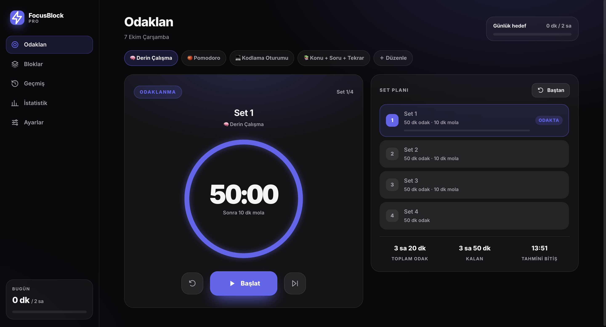
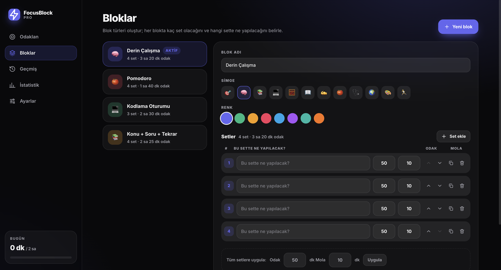
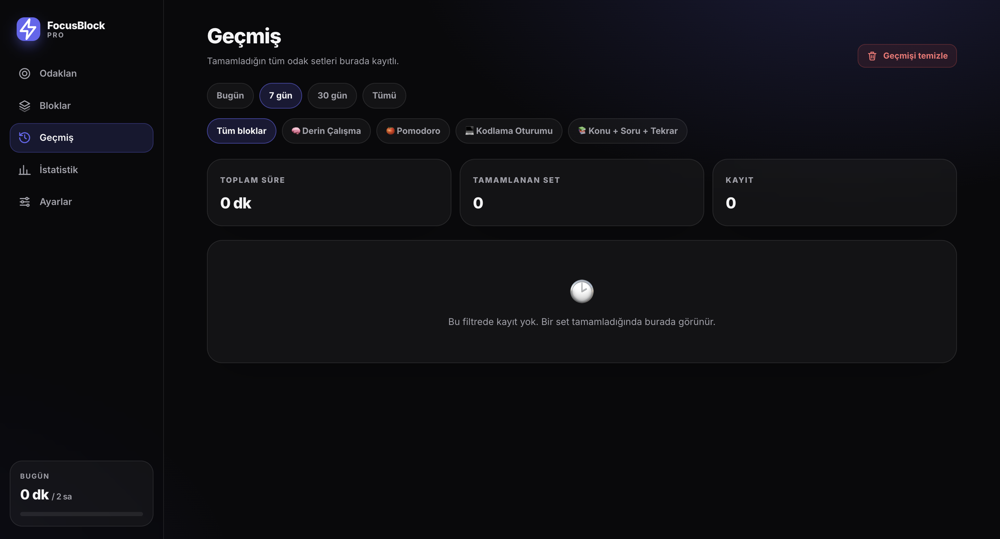
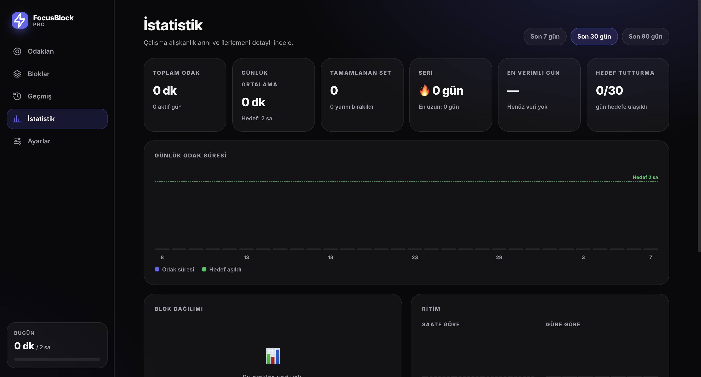
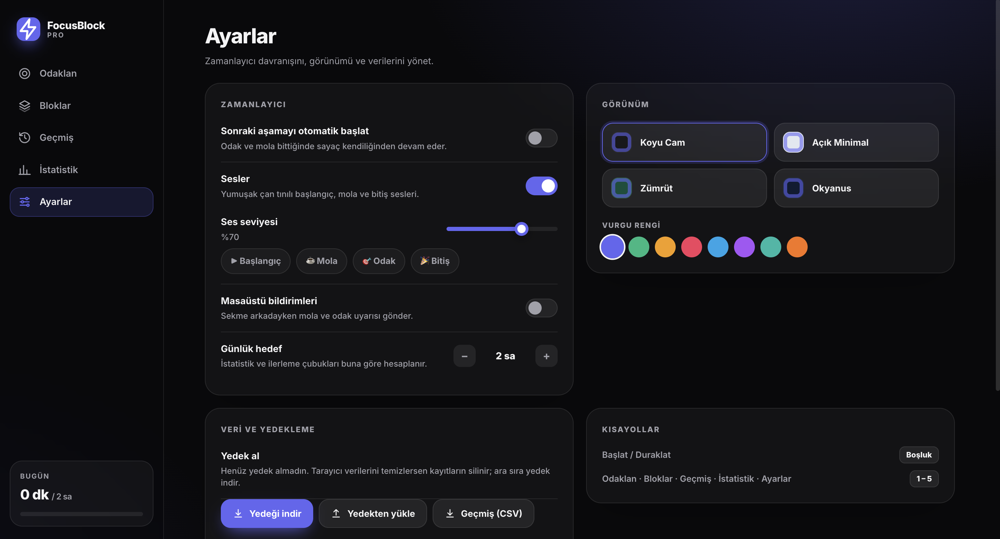

# ⚡ FocusBlock PRO

**FocusBlock PRO**, verimliliğinizi artırmak, odaklanma sürelerinizi kişiselleştirmek ve çalışma alışkanlıklarınızı detaylı istatistiklerle takip etmeniz için tasarlanmış modern bir zamanlayıcı ve odaklanma uygulamasıdır.

---

## 📸 Ekran Görüntüleri

### 🎯 Odaklan (Timer Ekranı)

Esnek set yapısı, geri sayım sayacı ve günlük hedef takibi.


### 🧩 Bloklar (Kişiselleştirilmiş Çalışma Blokları)

Farklı çalışma rutinleri oluşturun, renk ve simgelerle özelleştirin.


### 📜 Geçmiş

Tamamlanan tüm odaklanma oturumlarınızı detaylı bir şekilde filtreleyin ve inceleyin.


### 📊 İstatistikler

Çalışma sürelerinizi, serilerinizi ve günlük hedeflerinizi grafiklerle analiz edin.


### ⚙️ Ayarlar

Koyu/açık tema seçenekleri, vurgu renkleri, ses/bildirim tercihleri ve veri dışa aktarma.


---

## ✨ Öne Çıkan Özellikler

- **Gelişmiş Odaklanma Sayacı:** Set tabanlı çalışma (odaklanma + mola) yapısı.
- **Esnek Blok Yönetimi:** İstediğiniz kadar özel odaklanma bloğu ve set oluşturma.
- **Detaylı İstatistikler & Grafik Günlükleri:** Seriler (Streak), günlük ortalamalar ve zaman dağılımları.
- **Kişiselleştirilebilir Temalar:** Koyu Cam, Açık Minimal, Zümrüt, Okyanus ve farklı vurgu renkleri.
- **Veri Güvenliği & Yedekleme:** Verilerinizi cihazınızda tutun, dilediğinizde JSON yedek alın veya CSV olarak dışa aktarın.
- **Klavye Kısayolları:** Sayfalar arası hızlı geçiş ve sayacı kolayca kontrol etme imkanı.

---

## ⌨️ Klavye Kısayolları

Uygulama içinde daha hızlı gezinmek için aşağıdaki kısayolları kullanabilirsiniz:

| Kısayol            | İşlev                        |
| :----------------- | :--------------------------- |
| `Boşluk` (`Space`) | Sayacı Başlat / Duraklat     |
| `1`                | **Odaklan** Sayfasına Git    |
| `2`                | **Bloklar** Sayfasına Git    |
| `3`                | **Geçmiş** Sayfasına Git     |
| `4`                | **İstatistik** Sayfasına Git |
| `5`                | **Ayarlar** Sayfasına Git    |

---

## 🚀 Kurulum ve Çalıştırma

Projeyi yerel ortamınızda çalıştırmak için aşağıdaki adımları izleyin:

1. **Repoyu klonlayın:**
   ```bash
   git clone [https://github.com/oguzbatuhan/FocusBlock.git](https://github.com/oguzbatuhan/FocusBlock.git)
   cd FocusBlock
   ```
